# AWS Group Project - Group 1 – Designing a Secure and Scalable AWS Cloud Infrastructure Project

## Overview
This repository contains group 1s AWS project which involves designing and deploying a secure and scalable AWS infrastructure to host a basic web application backed by a private database.

We worked through each stage of the project collaboratively. Our aim was to follow AWS best practices while learning how cloud environments are built and secured in real-world scenarios.

## Task 1 – Architecture Design

We started by planning the cloud architecture:
- We made a plan to create a custom VPC with both public and private subnets.
    - Place the EC2 Webserver instance in a public subnet.
    - Place the EC2 Database instance in a private subnet.
    - Configure routing, an Internet Gateway, and a NAT Gateway for proper traffic flow.
    - Set up security groups to control which parts could talk to each other.

Our architecture diagram can be found in the `task1_architecture/` folder.
### AWS Architecture Diagram
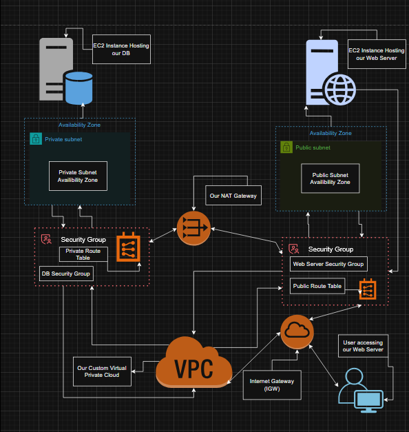

## Task 2 – Manual Implementation (AWS Console)

In this step, we manually built the infrastructure using the AWS Management Console:
- We launched EC2 instances for the web and database servers.
- We set up subnets, route tables, NAT Gateway, and Internet Gateway.
- Verified that the web server is publicly accessible.
- Confirmed that the web server can securely connect to the private database.

Screenshots and documentation are located in `task2_implementation/`.

## AWS Implementation Screenshot Links:

### 1. We started by creating our Group1-Virtual Private Cloud
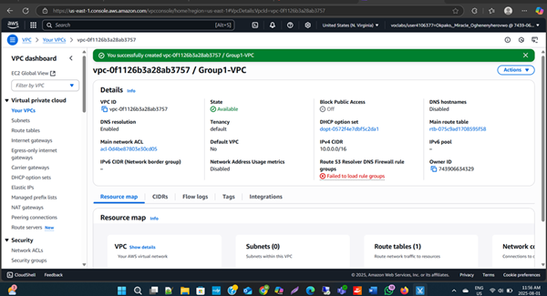

### 2. Next, we created a public and private subnet 

### 3. Private Subnet
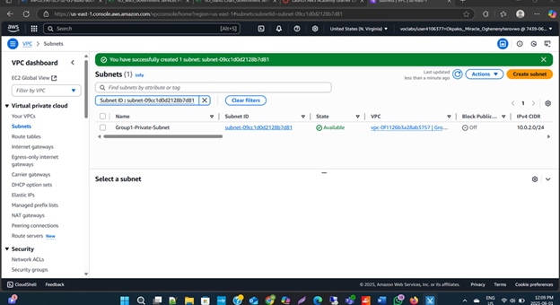

### 4. Both of our Subnets:
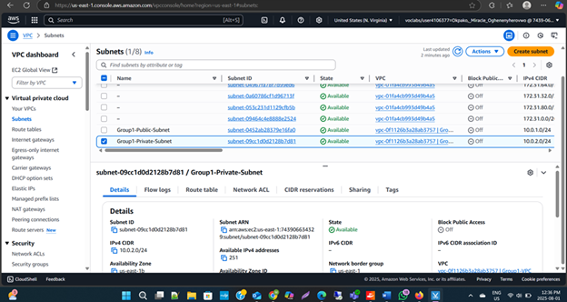

### 5. We then created an internet gateway 
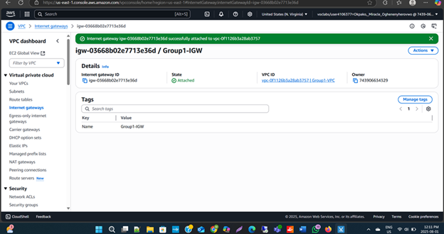

### 6. Next, we configured route tables
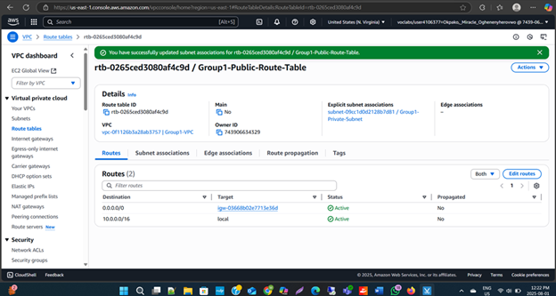

### 7. Private Route Table
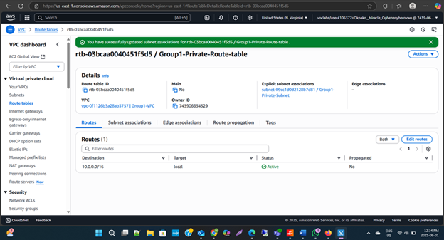

### 8. NAT gateway configuration 
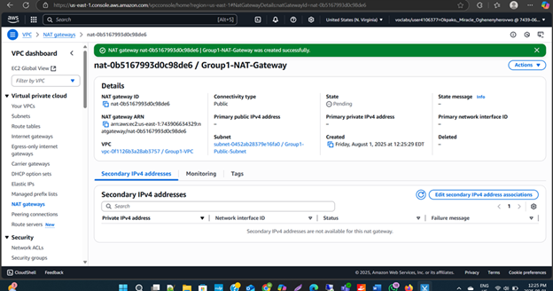

### 9. Then, we configured security groups to control the flow of traffic to our EC2 instances
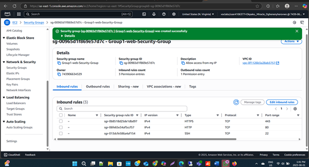

### 10. Database Security Group 
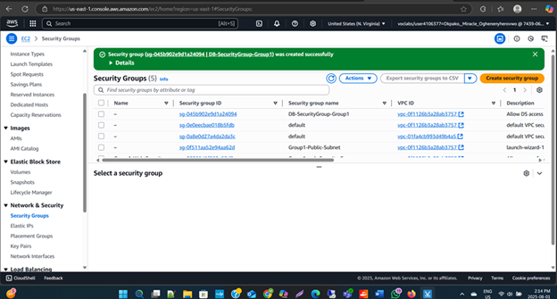

### 11. Finally we deployed a webserver and a database EC2 instance 
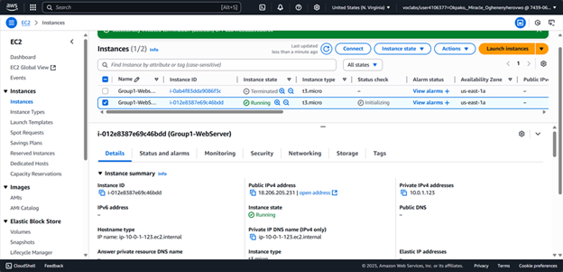

### 12. Database EC2 Instance 
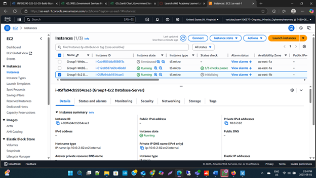

## Task 3 – Infrastructure as Code (CloudFormation)

We converted our manual infrastructure setup into code using CloudFormation:
- We made a template to automate creation of the VPC, subnets, EC2 instances, and networking components.
- This allowed us to quickly redeploy the infrastructure without using the console.

CloudFormation templates and setup instructions are in `task3_automation/`.

## Task 4 – Security Considerations

In this final step, we reviewed and documented the security of our system:
- Database is not exposed to the internet, only the web server can access it.
- We used private key authentication for SSH instead of passwords.
- We used isolated subnets and security groups to tightly control traffic.

Our security design and notes are in the `task4_security/` folder.

## Summary

This project helped us learn how to:
- Design a secure cloud architecture.
- Use both the AWS Console and Infrastructure-as-Code tools.
- Use best practices for public and private subnet usage.
- Apply real-world security configurations in AWS.

We’re Group 1, and this is our AWS cloud infrastructure project, everything is organized by task inside this repository.

